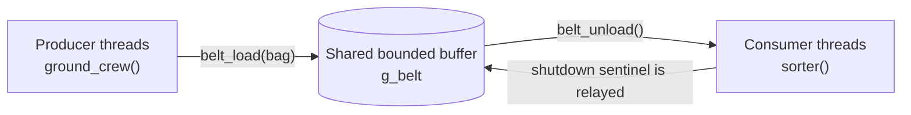

<div align="center">

<h1>Producer-Consumer-POSIX</h1>
<p><strong>Airport baggage handling simulation with POSIX threads, mutexes, and semaphores</strong></p>
<p>Educational systems programming project that demonstrates how a bounded shared buffer coordinates multiple producers and consumers safely.</p>

</div>

> [!IMPORTANT]
> This project is intended for a POSIX-compatible toolchain. On Windows, build it inside WSL, MSYS2, or another environment that provides `pthread` and semaphore support.

## Quick Facts

| Item | Value |
| --- | --- |
| Language | C |
| Concurrency model | POSIX threads (`pthread`) plus mutexes and semaphores |
| Executable | `airport_sim` |
| Log file | `simulation.log` |
| Build system | GNU Make in `src/makefile` |
| Shared buffer | `g_belt`, a bounded circular buffer |
| Default work unit | `BAGS_PER_FLIGHT = 10` bags per producer |

## Overview

This repository models an airport baggage handling line. Each producer thread represents a ground crew unloading bags from a flight onto a shared conveyor belt, and each consumer thread represents a sorting worker removing those bags from the belt. The project is intentionally small enough to study, but rich enough to show the real concurrency problems that operating systems must solve.

The code is organized to make the producer-consumer pattern easy to trace from top to bottom:

- `src/main.c` orchestrates input, thread creation, shutdown, and cleanup.
- `src/belt.c` implements the bounded buffer.
- `src/ground_crew.c` produces bags.
- `src/sorter.c` consumes bags.
- `src/logger.c` serializes console output and writes the simulation log.
- `src/common.h` holds the shared types, globals, macros, and prototypes.

## 🎯 Scenario

The classic producer-consumer problem asks a simple question: what happens when work is created faster or slower than it can be processed? In this simulation, producers add bags to a shared buffer, consumers remove them, and the buffer itself has a fixed capacity. If the belt fills up, producers must wait. If it empties out, consumers must wait.



> [!NOTE]
> The belt is not an abstract idea here, it is real shared memory in RAM. The entire exercise is about protecting that memory while still allowing several threads to work at the same time.

## 🧩 Implementation Map

| File | Responsibility |
| --- | --- |
| `src/main.c` | Collects runtime configuration, initializes globals, starts producer and consumer threads, handles `SIGINT`, prints the final report, and releases resources. |
| `src/belt.c` | Implements the bounded circular buffer using `pthread_mutex_t` plus the `empty` and `full` semaphores. |
| `src/ground_crew.c` | Producer thread routine. Each crew unloads `BAGS_PER_FLIGHT` bags, updates flight statistics, and logs progress. |
| `src/sorter.c` | Consumer thread routine. Each worker removes bags from the belt, updates worker statistics, and exits when it sees the sentinel bag. |
| `src/logger.c` | Provides synchronized logging, live belt visualization, and the final summary report. |
| `src/common.h` | Central shared header for macros, structs, globals, and function prototypes. |

## ⚙️ Low-Level OS Reality

What makes this project educational is the gap between the simple story and the real machine underneath it. The machine does not “care” that one thread is a producer and another is a consumer. It only sees independent execution contexts whose instructions can be interleaved by the scheduler at almost any point.

### Race Conditions

A race condition appears when two threads access the same memory without proper coordination and at least one of them writes. The danger is not theoretical. A statement that looks like a single action in C, such as incrementing `count` or advancing `head`, is usually multiple machine-level steps: load a value, modify it, then store it back.

If a context switch happens between those steps, another thread may observe or overwrite a partially updated state. On multicore systems, the problem is even more subtle because each core may keep recently used values in registers or caches, so unsynchronized reads can see stale data.

### Critical Sections

A critical section is the exact region of code that must not be executed concurrently by more than one thread. In this repository, the critical sections are the updates to `g_belt.slots`, `g_belt.head`, `g_belt.tail`, and `g_belt.count`, plus the console and file output paths that would otherwise interleave text from multiple threads.

The important point is that the critical section is not the entire function. It is only the smallest region that touches shared state. Keeping that region small helps performance, because threads spend less time waiting.

### Mutual Exclusion

Mutual exclusion means only one thread can own the critical section at a time. `pthread_mutex_lock()` and `pthread_mutex_unlock()` provide that guarantee. Under the hood, the implementation relies on atomic CPU instructions such as compare-and-swap or test-and-set, and, when contention appears, the operating system blocks the losing thread instead of letting it spin forever.

This is why the belt updates are safe:

- The producer waits for a free slot with `sem_wait(&g_belt.empty)`.
- The producer then locks `g_belt.mutex` before touching the buffer indices and the slot array.
- The consumer performs the mirrored sequence with `sem_wait(&g_belt.full)` and the same mutex.
- After the shared state is updated, the thread unlocks the mutex and posts the opposite semaphore so the other side can continue.

That sequence prevents buffer overflow, buffer underflow, and torn updates to the ring buffer metadata.

### Hardware and Resource Mapping

| Scenario concept | What it really maps to | Why it matters |
| --- | --- | --- |
| Producer / consumer | POSIX threads scheduled as independent execution contexts | Each thread can run, sleep, block, and resume independently. |
| Shared buffer | A bounded region of RAM implemented as `g_belt.slots[]` | This is the actual shared memory that must be protected from concurrent modification. |
| Empty semaphore | A counter for free buffer slots | Producers block when there is no space left on the belt. |
| Full semaphore | A counter for occupied buffer slots | Consumers block when there are no bags to remove. |
| Mutex | An atomic lock word plus scheduler-assisted blocking and wake-up | Protects the circular buffer state and prevents simultaneous writes. |
| Log mutex | A second mutex guarding stdout and the log file | Prevents mixed console lines and keeps the report readable. |
| Scheduler | The OS component that decides which thread runs next | Context switches can happen between any two instructions unless synchronization prevents corruption. |
| Registers and caches | Per-thread CPU state and core-local memory views | Synchronization forces visibility and ordering so one thread sees what another just published. |

### How the POSIX Primitives Solve It

`pthread_create()` turns the producer and consumer functions into independently scheduled threads. `pthread_join()` later waits for those threads to finish so the program can shut down in a controlled way.

`pthread_mutex_t` protects the critical section in the belt and logging code. When a thread acquires the mutex, it gets exclusive access to the shared state. When it releases the mutex, the update becomes visible to the next thread that enters the same protected region.

The semaphores are the real flow-control mechanism. `sem_wait()` decrements the semaphore if a resource exists, or blocks the thread if it does not. `sem_post()` increments the semaphore and wakes a waiting thread if needed. In this project, `empty` tracks available slots and `full` tracks bags waiting on the belt.

> [!NOTE]
> This repository uses semaphores rather than `pthread_cond_t`, but the design goal is the same. A condition-variable version would wait on predicates such as “buffer not empty” or “buffer not full” while holding the mutex. Semaphores simply package the waiting condition into the counter itself, which keeps the bounded-buffer logic compact and easy to follow.

The shutdown protocol is also worth studying. Normal shutdown injects a sentinel bag with `bag_id == -1`. Each worker that sees the sentinel passes it along and exits, so the wake-up signal moves through the pool without busy waiting. That is a practical example of how a low-level synchronization primitive can also carry application-level meaning.

## 📚 Documentation Index

The `docs/` folder contains a guide for every source module. Read them alongside the code to see the same explanation from different angles: implementation, synchronization, and cross-file dependency flow.

| Guide | What you will learn |
| --- | --- |
| [belt_c_guide.md](docs/belt_c_guide.md) | The bounded-buffer implementation, including the ring buffer layout, semaphore usage, and why `belt_load()` and `belt_unload()` are safe under concurrent access. |
| [common_h_guide.md](docs/common_h_guide.md) | The shared macros, data structures, globals, and prototypes that connect every translation unit in the project. |
| [ground_crew_c_guide.md](docs/ground_crew_c_guide.md) | How each producer thread creates bags, simulates unloading time, updates flight statistics, and reports progress. |
| [logger_c_guide.md](docs/logger_c_guide.md) | How logging is serialized, how the live belt visualization works, and how the final report is written to both the terminal and `simulation.log`. |
| [main_c_guide.md](docs/main_c_guide.md) | The full startup and shutdown flow, including input validation, thread orchestration, sentinel-based termination, and cleanup. |
| [sorter_c_guide.md](docs/sorter_c_guide.md) | How each consumer thread waits for work, processes bags, relays the shutdown sentinel, and records worker statistics. |

## 🛠️ Compilation and Execution

### What a Makefile Is

A `Makefile` is a build recipe. Instead of manually typing the same compiler command every time, `make` reads the dependency graph, checks timestamps, and rebuilds only the parts of the program that are out of date.

In this repository, the Makefile lives in `src/`, not the repository root. That means the simplest workflow is to build from `src/` or to use `make -C src` from the root directory.

### What Happens Behind the Scenes

1. The preprocessor expands `#include "common.h"` and substitutes macros such as `MAX_BUFFER` and `SENTINEL`.
2. Each `.c` file is compiled into an object file, for example `main.o` or `belt.o`.
3. The linker combines those object files into the final executable, `airport_sim`.
4. The final link step includes `-pthread`, which is required for the POSIX thread symbols used throughout the project.

The Makefile also makes `common.h` a dependency for every object file. If that header changes, `make` knows that all translation units need to be rebuilt.

### Make Targets

| Target | What it does | Notes |
| --- | --- | --- |
| `all` | Builds the executable and prints a success message. | This is the default target, so plain `make` is enough. |
| `airport_sim` | Links `main.o`, `belt.o`, `ground_crew.o`, `sorter.o`, and `logger.o` into the final binary. | This is the actual program target defined in the Makefile. |
| `%.o: %.c common.h` | Compiles each source file into its matching object file. | The shared header is part of the dependency list, so header edits trigger rebuilds. |
| `run` | Builds the program and immediately runs it. | Equivalent to `make all` followed by `./airport_sim`. |
| `clean` | Removes object files, the executable, and `simulation.log`. | Use this to return the tree to a fresh state. |

### Build, Run, and Clean

```bash
git clone https://github.com/syedsufyan-coder/Producer-Consumer-POSIX.git
cd Producer-Consumer-POSIX/src
make
./airport_sim
make clean
```

From the repository root, the equivalent build and cleanup commands are `make -C src` and `make -C src clean`.

### Expected Console Output

| Command | What you should see |
| --- | --- |
| `make` | The object files and executable are built, then the Makefile prints `Build successful!` and reminds you to run `./airport_sim`. |
| `./airport_sim` | A stylized airport banner, scenario hints, interactive prompts, live producer and consumer log lines, a belt occupancy meter, and a final summary report. |
| `make run` | The same build output as `make`, followed by the interactive simulation. |
| `make clean` | A short cleanup message and removal of `*.o`, `airport_sim`, and `simulation.log`. |

### Runtime Configuration

When the program starts, it asks for five values. These are validated before the simulation begins.

| Prompt | Range | Meaning |
| --- | --- | --- |
| Number of flights | `1` to `8` | Number of producer threads. |
| Number of sorters | `1` to `8` | Number of consumer threads. |
| Belt capacity | `2` to `20` | Size of the shared buffer. |
| Unload delay | `10000` to `2000000` microseconds | How long a producer waits before unloading each bag. |
| Sort delay | `10000` to `2000000` microseconds | How long a consumer waits after sorting each bag. |

> [!TIP]
> The startup banner prints three suggested delay pairings: a producer-heavy bottleneck, a consumer-heavy bottleneck, and a balanced case. Those presets are a quick way to observe the difference between a full belt, an empty belt, and a stable system.

### What the Program Produces

- A live, colored conveyor-belt meter that shows how full the shared buffer is.
- Per-flight and per-worker log lines that are mirrored to `simulation.log`.
- A final report that lists how many bags each producer unloaded and how many each worker sorted.
- A clean shutdown path that uses a sentinel bag to wake blocked workers.

> [!NOTE]
> The program is interactive by design. It is meant to teach scheduling, blocking, and synchronization, not to run as a background daemon.

## Closing Thought

If you read the source and the guides together, the key lesson is not just how to use pthreads, it is how to think about shared state. The buffer is only safe because every update has a clearly defined owner, a protected critical section, and a wake-up rule for the other side of the handoff. That is the heart of producer-consumer programming.