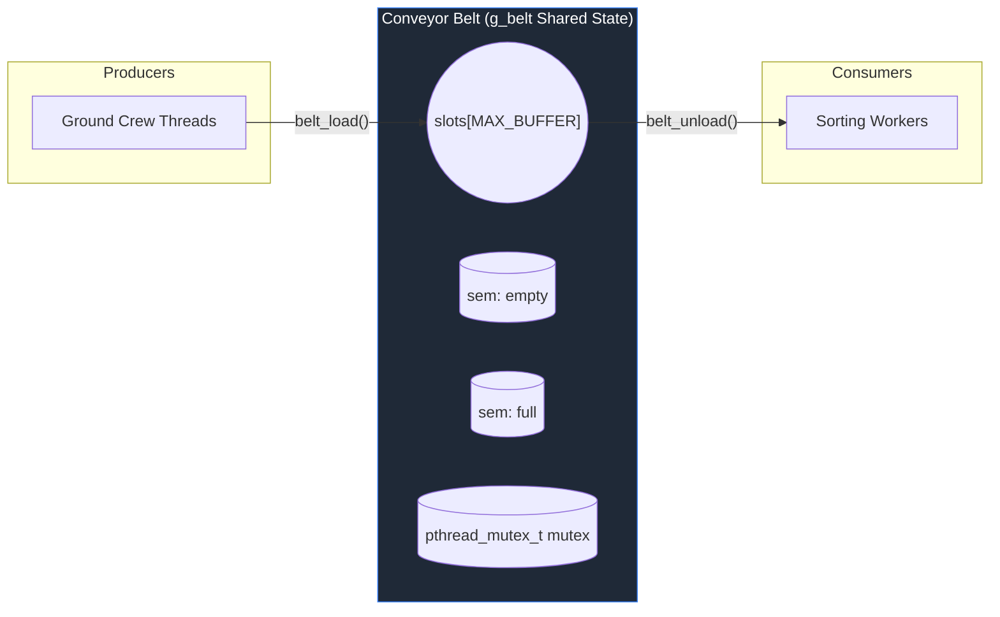

# Conveyor Belt Implementation and API Reference

This document provides a technical specification of the conveyor-belt implementation in `src/belt.c`. It follows the same documentation pattern as other guides in the `docs/` folder and explains the implementation, concurrency model, and how the belt primitives are used across the project.

---

## Architectural Overview

`src/belt.c` implements a bounded-buffer (circular queue) with classic producer-consumer synchronization using POSIX semaphores and a mutex. Producers call `belt_load()` to add `Bag` items; consumers call `belt_unload()` to remove them.

### System Architecture



# Full source of `src/belt.c`

The following is the literal, unmodified content of `src/belt.c` in this workspace:

```c

#include "common.h"

void belt_init(void)
{
    g_belt.head  = 0;
    g_belt.tail  = 0;
    g_belt.count = 0;

    pthread_mutex_init(&g_belt.mutex, NULL);
    sem_init(&g_belt.empty, 0, g_belt.capacity); /* all slots free */
    sem_init(&g_belt.full,  0, 0);               /* no bags yet    */
}


void belt_load(Bag bag)
{
    sem_wait(&g_belt.empty);              /* wait for free slot  */

    pthread_mutex_lock(&g_belt.mutex);

    g_belt.slots[g_belt.tail] = bag;
    g_belt.tail = (g_belt.tail + 1) % g_belt.capacity;
    g_belt.count++;

    pthread_mutex_unlock(&g_belt.mutex);

    sem_post(&g_belt.full);               /* signal bag is ready */
}

Bag belt_unload(void)
{
    sem_wait(&g_belt.full);               /* wait for a bag      */

    pthread_mutex_lock(&g_belt.mutex);

    Bag bag = g_belt.slots[g_belt.head];
    g_belt.head = (g_belt.head + 1) % g_belt.capacity;
    g_belt.count--;

    pthread_mutex_unlock(&g_belt.mutex);

    sem_post(&g_belt.empty);              /* signal slot is free */

    return bag;
}

void belt_destroy(void)
{
    pthread_mutex_destroy(&g_belt.mutex);
    sem_destroy(&g_belt.empty);
    sem_destroy(&g_belt.full);
}
```


# Known Architectural Notes

> [!NOTE]
> `src/belt.c` contains the canonical implementations for the belt primitives. It expects the `Belt` type and the global `g_belt` to be declared (and `g_belt.capacity` set) before `belt_init()` is called.

This file is focused and contains no top-level anomalies; it uses the standard semaphore+mutex producer-consumer pattern.

## Technical Walkthrough & Analysis

This section explains the implementation of each public function in `src/belt.c`, the synchronization semantics, and practical prerequisites.

### 1. `belt_init`

Initializes the `g_belt` indices and the synchronization primitives.

- **Purpose**: Prepare `g_belt` for concurrent use: set `head`, `tail`, and `count` to 0 and initialize `mutex`, `empty`, and `full`.
- **Prerequisites**: `g_belt.capacity` must be set (typically from `g_cfg.belt_size` in `main.c`) and > 0 before calling this function.
- **Semantics**: `empty` is initialized with `g_belt.capacity` (all slots free); `full` starts at 0 (no items).

### 2. `belt_load`

Adds a `Bag` to the circular buffer as a producer operation.

- **Synchronization**:
  - `sem_wait(&g_belt.empty)` ensures a free slot exists (blocks producer if full).
  - `pthread_mutex_lock(&g_belt.mutex)` protects the critical section updating indices and `slots`.
  - After insertion and index/count updates, the function posts `full` to wake a consumer.
- **Invariants**: All updates to `slots`, `tail`, and `count` occur under the mutex.

### 3. `belt_unload`

Removes and returns the next `Bag` for a consumer.

- **Synchronization**:
  - `sem_wait(&g_belt.full)` blocks when buffer is empty until a producer posts.
  - `pthread_mutex_lock(&g_belt.mutex)` protects read/update of `head`, `slots`, and `count`.
  - After removing the item, the function posts `empty` to wake a producer.
- **Return semantics**: Returns a copy of the `Bag` stored in the ring at `head`.

### 4. `belt_destroy`

Destroys the synchronization primitives. Must be called after all threads join and no thread will access `g_belt`.

## Compilation & Cross-File Dependencies

Usage and callers:

```plaintext
[src/main.c]     -- initializes g_belt.capacity, calls belt_init(), belt_destroy()
[src/ground_crew.c] -- calls belt_load() to produce Bag items
[src/sorter.c]   -- expected to call belt_unload() to consume Bag items
[src/logger.c]   -- reads g_belt.count/g_belt.capacity for reporting
```

**Notes**:
- Ensure `g_belt.capacity` is assigned from `g_cfg.belt_size` in `main.c` before `belt_init()`.
- The implementation uses modulo arithmetic `% g_belt.capacity` — capacity must be > 0.