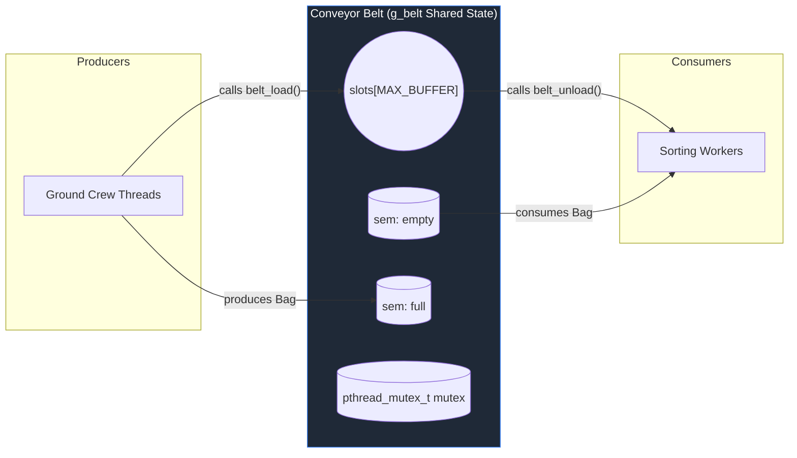

# Common/Shared Variables Interface and API Reference

This document provides a technical specification of the conveyor-belt-related declarations in `src/common.h`. It follows the repository documentation pattern and explains macros, types, global variables, and function prototypes that other translation units use.

---

## Architectural Overview

The project implements a bounded-buffer producer-consumer pattern using POSIX threads (`pthread`) and semaphores (`sem_t`). `src/common.h` declares the shared data structures, configuration, and public function prototypes used by producers (ground crew) and consumers (sorting workers).

### System Architecture



# Full source of `src/common.h`

The following is the literal, unmodified content of `src/common.h` in this workspace:

```c
#ifndef COMMON_H
#define COMMON_H

#include <stdio.h>
#include <stdlib.h>
#include <pthread.h>
#include <semaphore.h>
#include <unistd.h>
#include <string.h>
#include <signal.h>


#define MAX_PRODUCERS  8
#define MAX_CONSUMERS  8
#define MAX_BUFFER     20
#define BAGS_PER_FLIGHT 10   /* each ground crew unloads this many bags */

/* ── Sentinel: tells sorting worker to stop ── */
#define SENTINEL      -1

/* ── One bag on the conveyor belt ── */
typedef struct {
    int bag_id;       /* unique bag number          */
    int flight_id;    /* which flight it came from  */
} Bag;

/* ── The conveyor belt (shared bounded buffer) ── */
typedef struct {
    Bag             slots[MAX_BUFFER]; /* circular array              */
    int             head;              /* next slot to consume        */
    int             tail;              /* next slot to fill           */
    int             count;             /* bags currently on the belt  */
    int             capacity;          /* set from user input         */

    pthread_mutex_t mutex;             /* mutual exclusion            */
    sem_t           empty;             /* counts free belt slots      */
    sem_t           full;              /* counts bags on belt         */
} Belt;

/* ── Per-thread statistics ── */
typedef struct {
    int id;
    int count;   /* bags unloaded or sorted */
} Stats;


typedef struct {
    int num_flights;       /* number of producer threads  */
    int num_workers;       /* number of consumer threads  */
    int belt_size;         /* conveyor belt capacity      */
    int unload_delay_us;   /* producer usleep in microseconds */
    int sort_delay_us;     /* consumer usleep in microseconds */
} Config;

/* ── Globals (defined in main.c) ── */
extern Belt            g_belt;
extern Config          g_cfg;
extern Stats           g_flight_stats[MAX_PRODUCERS];
extern Stats           g_worker_stats[MAX_CONSUMERS];
extern volatile int    g_done;
extern pthread_mutex_t g_log_mutex;
extern FILE           *g_logfile;

/* ── Function prototypes ── */

/* belt.c */
void belt_init(void);
void belt_destroy(void);
void belt_load(Bag bag);
Bag  belt_unload(void);

/* ground_crew.c */
void *ground_crew(void *arg);

/* sorter.c */
void *sorter(void *arg);

/* logger.c */
void log_msg(const char *msg);
void print_belt(void);
void print_stats(void);

#endif
```


# Known Architectural Notes
> [!NOTE]
> `src/common.h` is a canonical header file in this workspace: it contains type definitions, macros, `extern` declarations, and prototype declarations. It is intended to be included by all translation units that participate in the producer-consumer simulation.

There are no implementation bodies in `src/common.h`; implementations live in corresponding `.c` files (for example, `belt.c` implements the belt primitives).

## Technical Walkthrough & Analysis

This section explains the key declarations in `src/common.h`, their purpose, and where they are used across the repository.

### Macros

- `MAX_PRODUCERS` / `MAX_CONSUMERS` / `MAX_BUFFER`: compile-time upper bounds used to size arrays and constrain user input. Referenced in `main.c` for statically-sized thread arrays and in `print_belt()` / `logger.c` for visual output.
- `BAGS_PER_FLIGHT`: controls how many `Bag` instances each producer (ground crew) generates. Used by `ground_crew()` in `ground_crew.c`.
- `SENTINEL`: special `bag_id` value used to signal sorting workers to stop. Produced by `main.c` when shutting down.

### Type Definitions

- `Bag` (struct): contains `bag_id` and `flight_id`. Producers construct `Bag` instances in `ground_crew.c`; consumers read these fields in their sorting logic (expected in `sorter.c`).
- `Belt` (struct): the shared bounded buffer containing:
  - `slots[MAX_BUFFER]`: circular array storing `Bag` items.
  - `head`, `tail`, `count`, `capacity`: indices and counters for circular-buffer semantics.
  - `mutex`, `empty`, `full`: synchronization primitives used by `belt.c` to implement correct producer/consumer behavior.
  `Belt` is instantiated as the global `g_belt` defined in `main.c`.
- `Stats`: per-thread counters (`id`, `count`) used for reporting in `print_stats()`.
- `Config`: runtime configuration collected interactively in `main.c` and referenced by producers/consumers for delays and counts.

### Globals

- `g_belt`: global `Belt` instance (defined in `main.c`). All belt operations (`belt_init`, `belt_load`, `belt_unload`, `belt_destroy`) operate on this instance.
- `g_cfg`: global `Config` instance populated by `main.c`.
- `g_flight_stats`, `g_worker_stats`: arrays of `Stats` used to track per-thread activity.
- `g_done`, `g_log_mutex`, `g_logfile`: program-wide control/status and logging objects used across `logger.c` and `main.c`.

### Function Prototypes (Where Implemented)

- `belt_init`, `belt_destroy`, `belt_load`, `belt_unload` — implemented in `src/belt.c`. These provide the producer-consumer synchronization primitives.
- `ground_crew` — implemented in `src/ground_crew.c` (producer thread function).
- `sorter` — implemented in `src/sorter.c` (consumer thread function).
- `log_msg`, `print_belt`, `print_stats` — implemented in `src/logger.c` and `src/main.c` for output and reporting.

## Cross-File Dependencies

Typical call and include graph:

```plaintext
[src/main.c] --defines--> g_belt, g_cfg, stats, g_logfile
      │
      ├─ includes common.h (types, prototypes)
      ├─ calls belt_init(), belt_destroy()
      ├─ starts threads: ground_crew (producers) and sorter (consumers)
[src/ground_crew.c] --includes--> common.h
      └─ calls belt_load(), uses BAGS_PER_FLIGHT and g_cfg
[src/sorter.c] --includes--> common.h
      └─ calls belt_unload(), reads SENTINEL to stop
[src/logger.c] --includes--> common.h
      └─ reads g_belt.count, g_belt.capacity and logs progress
```

**Notes & Usage**:
- Set `g_belt.capacity = g_cfg.belt_size;` in `main.c` before calling `belt_init()` to ensure semaphores and modulo arithmetic operate correctly.
- All shared-state mutations to `g_belt.slots`, `head`, `tail`, and `count` are synchronized by `g_belt.mutex` and the semaphore pair `empty`/`full` in `belt.c`.