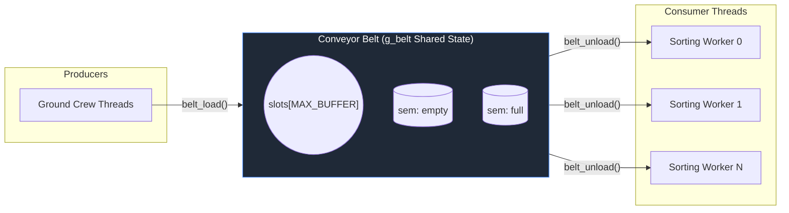

# Sorting Worker Consumer Implementation and API Reference

This document provides a technical specification of the consumer thread function implemented in `src/sorter.c` and explains the sorting worker's role in the producer-consumer simulation.

---

## Architectural Overview

`src/sorter.c` implements the consumer thread function that simulates sorting workers processing bags from the conveyor belt. Each sorting worker continuously calls `belt_unload()` to retrieve `Bag` instances from the belt, processes them (with simulated sorting delays), and tracks statistics. Workers terminate gracefully when they receive a sentinel signal.

### System Architecture



# Full source of `src/sorter.c`

The following is the literal, unmodified content of `src/sorter.c` in this workspace:

```c
#include "common.h"

void *sorter(void *arg)
{
    int id = *(int *)arg;
    char msg[128];

    snprintf(msg, sizeof(msg),
             "[Worker W%d] Sorting worker started. Waiting for bags...", id);
    log_msg(msg);

    while (1) {

        /* This call BLOCKS if belt is empty (sem_wait inside belt_unload) */
        Bag bag = belt_unload();

        /* Sentinel received: re-load it for the next worker, then exit */
        if (bag.bag_id == SENTINEL) {
            belt_load(bag);   /* pass sentinel along to wake next worker */
            snprintf(msg, sizeof(msg),
                     "[Worker W%d] Received shutdown signal. Clocking out.", id);
            log_msg(msg);
            break;
        }

        g_worker_stats[id].count++;

        snprintf(msg, sizeof(msg),
                 "[Worker W%d] Sorted  Bag ID %-4d  (Flight %d) --> Belt Status: %d/%d occupied",
                 id, bag.bag_id, bag.flight_id,
                 g_belt.count, g_belt.capacity);
        log_msg(msg);

        print_belt();

        usleep(g_cfg.sort_delay_us);   /* simulate sorting time */
    }

    snprintf(msg, sizeof(msg),
             "[Worker W%d] Done. Total bags sorted: %d",
             id, g_worker_stats[id].count);
    log_msg(msg);

    return NULL;
}
```


# Known Architectural Notes

> [!NOTE]
> `src/sorter.c` defines the consumer thread function (`sorter`) which is called via `pthread_create()` from `main.c`. Each instance runs independently as a consumer, retrieving `Bag` items from the shared conveyor belt and processing them at a configurable rate until a sentinel signal is received.

This file contains no data structure definitions or global state; it is a pure thread function that uses externally-defined types and globals.

## Technical Walkthrough & Analysis

This section explains the `sorter()` function, its parameters, thread lifecycle, sentinel handling, and interactions with the shared state and synchronization primitives.

### Function Signature & Parameter

**`void *sorter(void *arg)`**

- **Parameter**: `void *arg` — a pointer to an `int` (thread ID). Cast to `int *` and dereferenced to extract the worker index (e.g., 0, 1, 2...).
- **Return Value**: Always `NULL`. Required by `pthread_create()` contract.
- **Thread Semantics**: This function runs as an independent thread; multiple instances execute concurrently.

### Execution Flow

#### 1. Thread Initialization

```c
int id = *(int *)arg;
char msg[128];

snprintf(msg, sizeof(msg),
         "[Worker W%d] Sorting worker started. Waiting for bags...", id);
log_msg(msg);
```

- **`id`**: The sorting worker thread index (0 to `g_cfg.num_workers - 1`).
- **`msg`**: Local buffer for formatted logging messages (128 bytes).
- Formats an initialization message and logs it via `log_msg()`.
- **Dependencies**: `log_msg()` (function from `logger.c`).

#### 2. Main Processing Loop

```c
while (1) {

    /* This call BLOCKS if belt is empty (sem_wait inside belt_unload) */
    Bag bag = belt_unload();

    /* Sentinel received: re-load it for the next worker, then exit */
    if (bag.bag_id == SENTINEL) {
        belt_load(bag);   /* pass sentinel along to wake next worker */
        snprintf(msg, sizeof(msg),
                 "[Worker W%d] Received shutdown signal. Clocking out.", id);
        log_msg(msg);
        break;
    }

    g_worker_stats[id].count++;

    snprintf(msg, sizeof(msg),
             "[Worker W%d] Sorted  Bag ID %-4d  (Flight %d) --> Belt Status: %d/%d occupied",
             id, bag.bag_id, bag.flight_id,
             g_belt.count, g_belt.capacity);
    log_msg(msg);

    print_belt();

    usleep(g_cfg.sort_delay_us);   /* simulate sorting time */
}
```

- **Infinite Loop**: Continues until a sentinel bag is processed and `break` is executed.

**Consumer Action**: `Bag bag = belt_unload()` retrieves the next bag from the shared belt. This is a blocking call that waits on the `full` semaphore if the belt is empty. The function acquires the mutex, reads a `Bag`, updates indices, releases the mutex, and posts `empty` to wake producers.

**Sentinel Detection**: Checks if `bag.bag_id == SENTINEL`. The sentinel is a special value (-1, defined in `common.h`) used by `main.c` to signal workers to shut down gracefully.

**Sentinel Propagation**: When a sentinel is received:
  - The worker re-posts it via `belt_load(bag)` so the next worker also receives it.
  - This chain reaction ensures all workers eventually receive the signal and terminate.
  - The worker logs the shutdown message and breaks from the loop.

**Statistics Update**: `g_worker_stats[id].count++` increments the count of bags sorted by this worker. Safe from races because each `id` is unique (no two threads access the same worker's stats).

**Status Reporting**: Logs detailed information about the bag being processed (worker ID, bag ID, flight ID) and calls `print_belt()` to display the current belt occupancy on the terminal.

**Delay Simulation**: `usleep(g_cfg.sort_delay_us)` pauses to simulate processing time. The delay (in microseconds) is configured interactively in `main.c`.

**Synchronization Notes**:
- `g_belt.count` and `g_belt.capacity` are read inside the critical section of `print_belt()` (which acquires `g_belt.mutex`).
- `g_worker_stats[id]` is written to without a lock; this works because each `id` is unique to one thread.

#### 3. Completion Message

```c
snprintf(msg, sizeof(msg),
         "[Worker W%d] Done. Total bags sorted: %d",
         id, g_worker_stats[id].count);
log_msg(msg);

return NULL;
```

- Logs a completion message summarizing the total bags processed by this worker.
- Returns `NULL` to satisfy the `pthread_create()` contract.
- The thread then terminates and can be joined in `main.c`.

## Cross-File Dependencies

Usage and callers:

```plaintext
[src/main.c]     -- spawns num_workers sorter threads via pthread_create()
                    passes &worker_id[i] as arg
                    calls pthread_join() to wait for completion
                    calls belt_load() to inject sentinel bags for shutdown

[src/sorter.c]   -- implements sorter() function
                    includes common.h

[src/common.h]   -- declares sorter prototype
                    declares Bag, Belt, Config, Stats types
                    declares g_belt, g_cfg, g_worker_stats globals
                    declares log_msg, print_belt functions
                    defines SENTINEL, MAX_CONSUMERS macros

[src/belt.c]     -- implements belt_unload() and belt_load() called by sorter()

[src/logger.c]   -- implements log_msg() and print_belt() called by sorter()
```

**Required Globals**:
- `g_cfg` (Config): specifically `g_cfg.sort_delay_us` and implicitly `g_cfg.num_workers`.
- `g_belt` (Belt): read for `g_belt.count` and `g_belt.capacity` in logging.
- `g_worker_stats` (Stats[]): write `g_worker_stats[id].count` for this thread.

**Required Function Calls**:
- `usleep()` (from `<unistd.h>`): simulates work delay.
- `snprintf()` (from `<stdio.h>`): formats messages.
- `log_msg()` (from `logger.c`): thread-safe logging.
- `belt_unload()` (from `belt.c`): consumer operation; blocks if belt empty.
- `belt_load()` (from `belt.c`): re-posts sentinel to wake next worker.
- `print_belt()` (from `logger.c`): displays belt status.

**Thread Safety**:
- Each thread has a unique `id` (0 to `num_workers - 1`) passed at creation time, so `g_worker_stats[id]` writes are non-overlapping.
- `log_msg()` and `print_belt()` use internal mutexes (`g_log_mutex`, `g_belt.mutex`) for thread safety.
- `belt_unload()` and `belt_load()` manage their own synchronization with semaphores and mutex.

**Shutdown Protocol**:
- `main.c` injects one sentinel per worker into the belt via `belt_load(sentinel)`.
- Each worker receives a sentinel, re-posts it, and terminates.
- This ensures all workers shut down cleanly without busy-waiting or deadlocks.